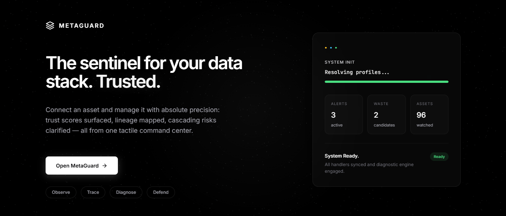
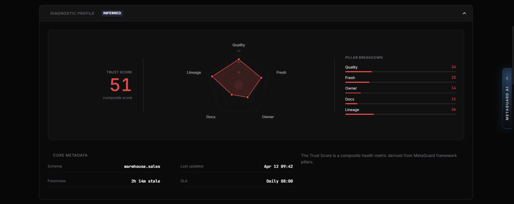
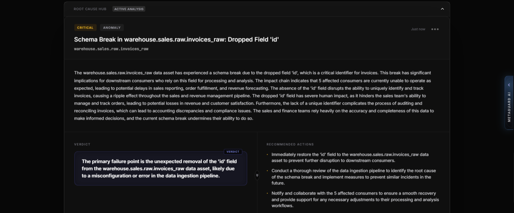
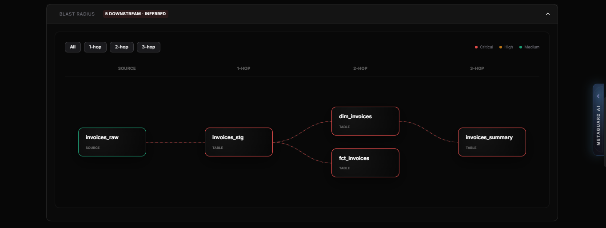
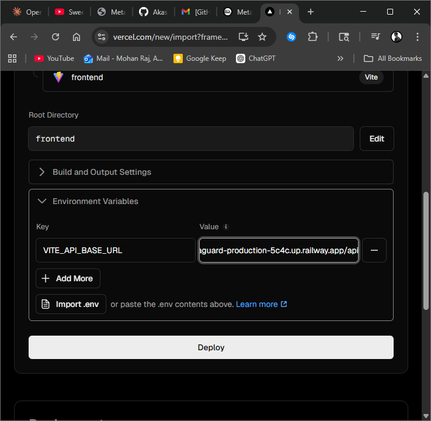
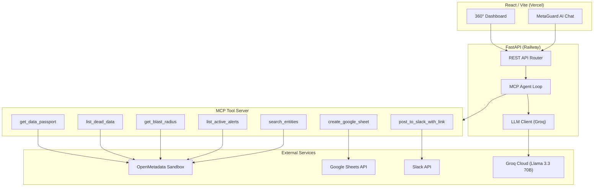
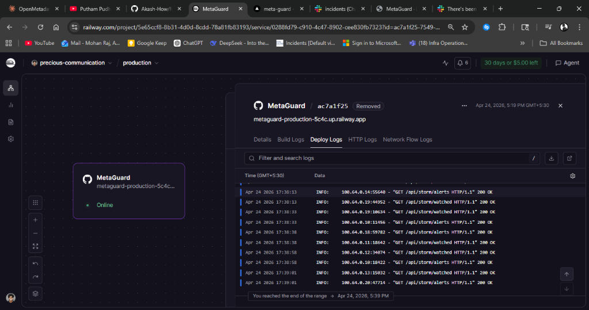

# 🛡️ MetaGuard

**Discover · Understand · Protect · Assess**

Unified data intelligence on OpenMetadata - an agentic AI platform that turns metadata into action.

## Overview



MetaGuard is a production-grade data governance platform built on top of [OpenMetadata](https://open-metadata.org). It provides data teams with four superpowers: find dead assets wasting money, generate plain-English summaries for any table, get alerts before schema changes break pipelines, and calculate the blast radius of any proposed change. Everything reads from OpenMetadata. No separate database. One shared Python API client. One React dashboard.

- **Agentic AI**: An MCP-powered orchestrator that chains tools autonomously - scan, analyze, export to Google Sheets, and post to Slack - all from a single natural language command.
- **Zero-Copy Architecture**: Everything reads from OpenMetadata. No separate database. One shared Python API client. One React dashboard.
- **Production-Ready**: Deployed on Railway (backend) and Vercel (frontend) with Groq-powered Llama 3.3 70B for ultra-low latency AI responses.

## Demo

- **Live App**: [meta-guard-puce.vercel.app](https://meta-guard-puce.vercel.app)
- **Repository**: [github.com/Akash-How/MetaGuard](https://github.com/Akash-How/MetaGuard)

---

## Core Modules

### Dead Data Finder
Scans every table in OpenMetadata for unused, duplicate, orphan, and stale assets. Calculates monthly cloud cost estimates and flags safe-to-delete candidates. Surfaces cost-savings opportunities that are invisible in raw metadata.

### Data Passport
Generates a comprehensive passport for any data asset - a single-page business and technical summary. Includes a composite Trust Score (0-100) derived from five pillars: Quality, Freshness, Ownership, Documentation, and Lineage.



### Storm Warning Center
Real-time alerts for schema drift, freshness SLA breaches, and quality regressions. Monitors all assets and surfaces actionable incidents ranked by severity - before they cascade into downstream failures.



### Blast Radius Analyzer
Calculates the downstream impact of any proposed change to a data asset. Traverses the full lineage graph to identify every affected pipeline, dashboard, and consumer - with a risk score and hop-distance breakdown.



#### Production Surveillance & Change Simulation
MetaGuard allows operators to simulate changes (like a column drop) and immediately visualize the downstream Blast Radius before the change is even committed to production.



### MetaGuard AI Orchestrator (MCP Agent)
A multi-tool agentic loop powered by the Model Context Protocol. The orchestrator can autonomously:
1. Search and analyze OpenMetadata entities
2. Generate Data Passports and Dead Data reports
3. Export findings to Google Sheets
4. Post actionable summaries to Slack with permalink links
5. Chain multiple tools in a single conversation turn

---

## Architecture



### Execution Flow

1. **User Query**: The React frontend sends a natural language command to the FastAPI backend.
2. **Agent Loop**: The MCP Agent constructs a tool-use plan and iteratively calls MCP tools.
3. **Tool Execution**: Each tool (passport, dead data, blast radius, etc.) queries OpenMetadata via the shared API client.
4. **Cross-Tool Chaining**: The agent can chain results - e.g., list_dead_data -> create_google_sheet -> post_to_slack_with_link.
5. **Response Synthesis**: The LLM synthesizes all tool outputs into a concise, actionable response.

---

## Tech Stack

| Layer | Technology | Role |
|-------|-----------|------|
| **Data** | OpenMetadata (Sandbox) | Single source of truth for all metadata |
| **Backend** | FastAPI + Python 3.11 | 4 module routers, MCP agent, shared core engine |
| **AI** | Groq Cloud (Llama 3.3 70B) | Ultra-low latency agentic reasoning |
| **MCP** | Model Context Protocol | Tool orchestration and agentic loop |
| **Frontend** | React 18 + TypeScript + Vite | 360° Dashboard with glassmorphic UI |
| **Integrations** | Google Sheets API, Slack SDK | Dynamic report export and team notifications |
| **Deploy** | Railway (backend) + Vercel (frontend) | Production cloud hosting |

---

## Dashboard

The 360° Dashboard provides a unified view of any data asset:



- **Trust Score**: Composite health metric from 5 governance pillars
- **Reliability SLA**: Freshness compliance percentage
- **Impact Blast**: Downstream dependency count with hop-distance breakdown
- **Diagnostic Profile**: Radar chart visualization of Quality, Freshness, Ownership, Docs, and Lineage
- **Core Metadata**: Schema, last updated timestamp, freshness status, and SLA configuration
- **Dead Data Tab**: Filterable list of stale, duplicate, orphan, and unused assets with cost estimates

---

## Project Structure

```
.
├── backend/                    # FastAPI Backend
│   ├── app/
│   │   ├── api/                # REST route handlers
│   │   │   └── routes/         # dead_data, passport, storm, blast, chat, rca
│   │   ├── clients/            # OpenMetadata SDK client, LLM client
│   │   ├── core/               # Config, settings, utilities
│   │   ├── mcp/                # MCP Tool Server (7 tools)
│   │   ├── schemas/            # Pydantic models and contracts
│   │   └── services/           # Business logic per module + MCP Agent
│   ├── mcp_config.json         # MCP server configuration
│   ├── requirements.txt        # Python dependencies
│   └── Procfile                # Railway start command
│
├── frontend/                   # React + Vite Frontend
│   ├── public/                 # Static assets (favicon)
│   ├── src/
│   │   ├── app/                # Main app, ProtoApp, components
│   │   ├── lib/                # API client, utilities
│   │   └── main.tsx            # Entry point
│   ├── index.html              # HTML shell
│   └── package.json            # Node dependencies
│
├── docs/                       # Architecture documentation
├── shared/                     # Shared contracts and examples
└── README.md                   # This file
```

---

## Quick Start

### Prerequisites
- Python 3.11+
- Node.js 18+
- OpenMetadata instance (or use the public sandbox)

### Backend
```bash
cd backend
python -m venv .venv && .venv\Scripts\activate   # Windows
pip install -r requirements.txt
cp .env.example .env                              # Configure your API keys
uvicorn app.main:app --reload --port 8000
```

### Frontend
```bash
cd frontend
npm install
npm run dev                                       # Starts on http://localhost:5173
```

### Environment Variables

| Variable | Location | Description |
|----------|----------|-------------|
| `GROQ_API_KEY` | Backend | Groq Cloud API key(s), comma-separated for rotation |
| `OPENMETADATA_JWT` | Backend | OpenMetadata personal access token |
| `OPENMETADATA_URL` | Backend | OpenMetadata server URL |
| `SLACK_BOT_TOKEN` | Backend | Slack Bot OAuth token for notifications |
| `GOOGLE_CREDENTIALS_JSON` | Backend | Google Service Account JSON (for Sheets export) |
| `VITE_API_BASE_URL` | Frontend | Backend API URL (e.g., `https://your-railway-url/api`) |

---

## Hackathon Tracks

| Track | Coverage |
|-------|----------|
| **T-01**: Build on OpenMetadata | Core platform - all data sourced from OM APIs |
| **T-02**: AI/ML for Data Governance | MCP Agent with autonomous tool chaining |
| **T-04**: Data Quality & Observability | Storm Warning, Trust Score, Freshness SLA |
| **T-06**: Data Discovery & Cataloging | Dead Data Finder, Search, Data Passport |

---

## Key Design Decisions

- **MCP over Raw API Calls**: Using Model Context Protocol gives the AI agent structured, typed tool access - making it debuggable, extensible, and safe for governance use cases.
- **Groq + Llama 3.3 70B**: Chosen for sub-second inference latency. API key rotation (comma-separated keys) handles rate limits gracefully.
- **Composite Trust Score**: A weighted average of 5 independently measurable pillars - no single metric can mask a governance gap.
- **Zero-Copy from OpenMetadata**: Every insight is derived from live metadata. No ETL, no shadow database, no stale snapshots.

---

Developed by **AKASH**
